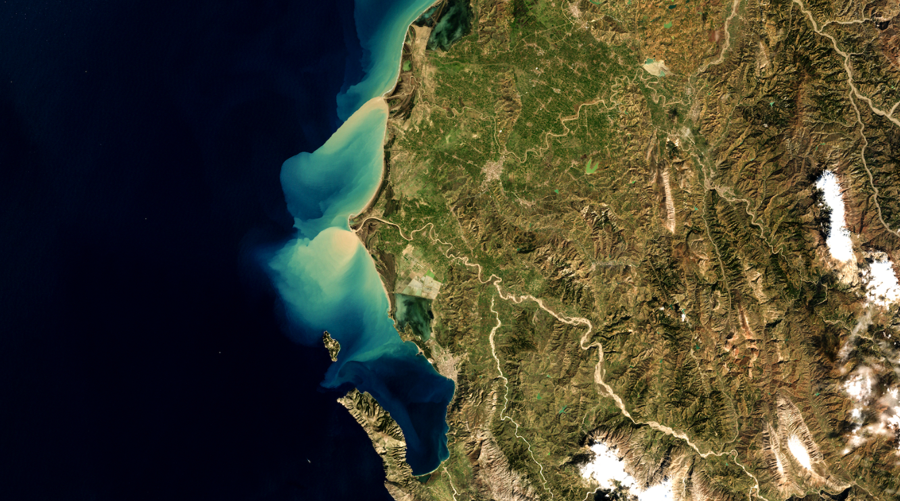
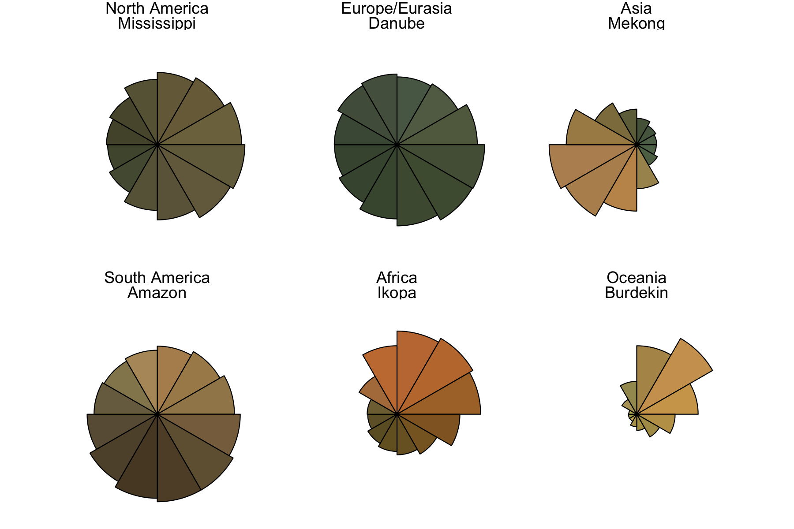
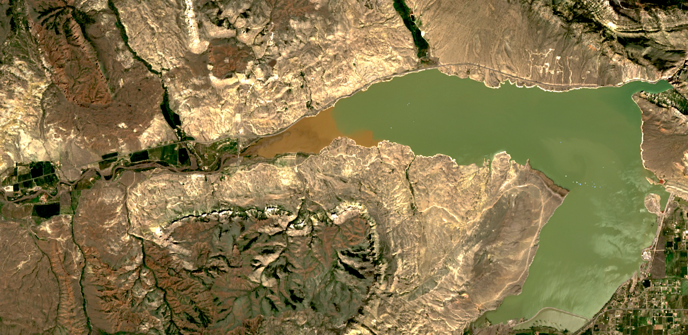
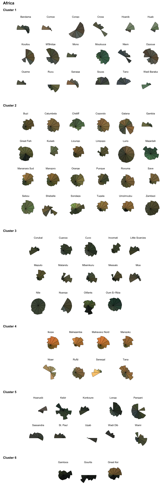
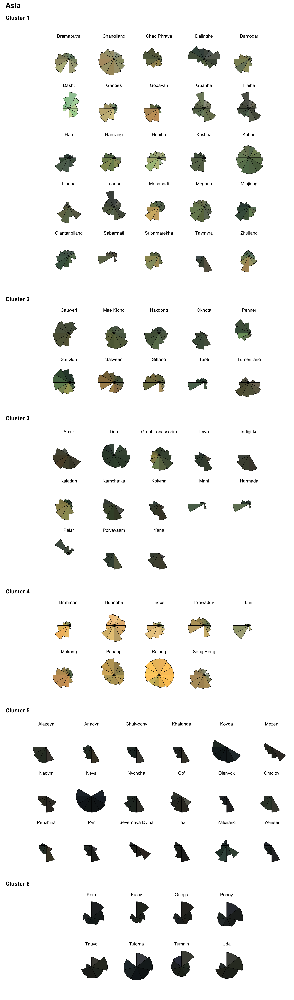
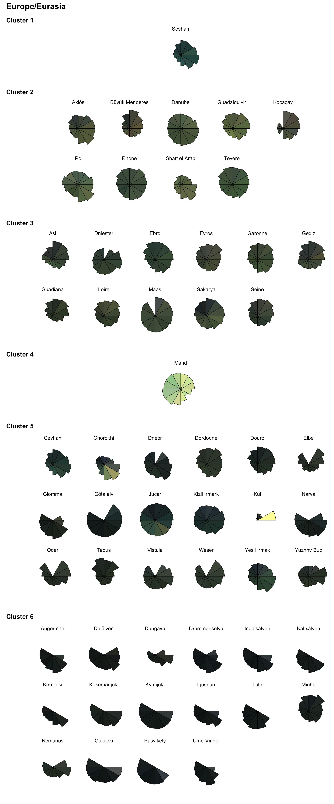
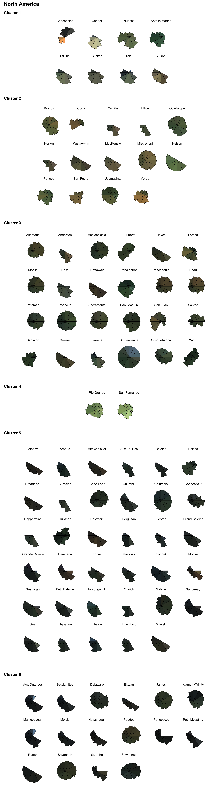
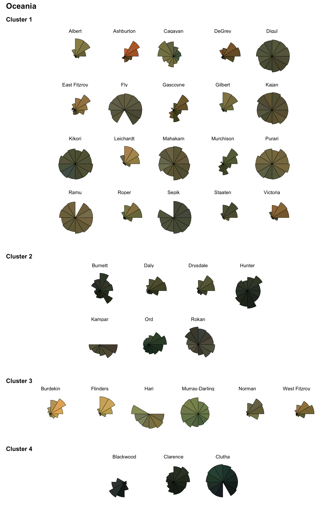
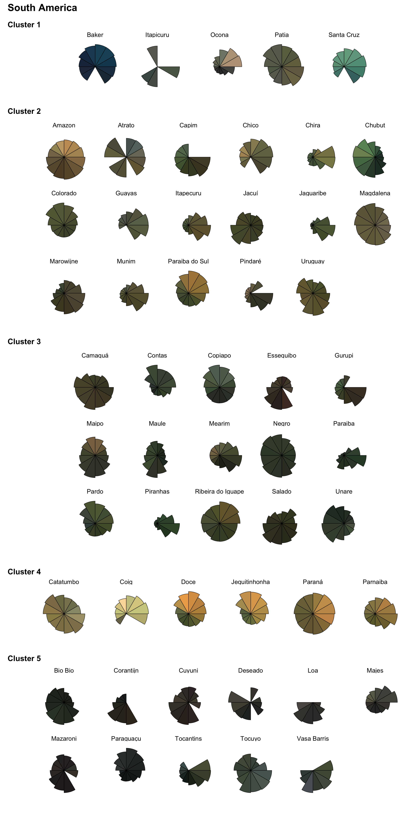

## Analyzing changes in river sediment transport

#### Introduction
The code in this repository builds on our efforts to analyze the transport of suspended sediment by rivers. We use satellite images to do these analyses, using [algorithms calibrated with more than 130,000 measurements](https://github.com/evandethier/satellite-ssc) made directly in rivers. This satellite-based approach is relatively new, and we're always trying to improve it! Its benefits are the ability to analyze millions of images globally, to get a sense of how rivers function or how they have changed over time.

**Rivers carrying sediment into the Mediterranean. Image from the Landsat 7 satellite.**

Rivers carrying different amounts and types of sediment reflect light differently. This makes them appear different to our eye, as we are able to distinguish a muddy river from a clear one. Satellites can also detect these differences, in some ways even better than we can. The satellites in the [**Landsat** program](https://landsat.gsfc.nasa.gov/) can detect reflectance in [six useful wavelength bands](https://www.usgs.gov/faqs/what-are-band-designations-landsat-satellites): Blue, Green, Red, two Near-infrared wavelengths, and Short-wave infrared. 

We can estimate suspended sediment concentration, a measure of the "muddiness" of a river, using algorithms based on these Landsat bands. 

* * *

#### Variations in river suspended sediment transport

Rivers often have a consistent seasonality, with higher water discharge and different appearance due to more or less sediment in the water column. In the visual below, each pie slice here represents a month for each river. The average monthly discharge is shown as the size of the pie slice. The pie color shows the true average river color for each month. 

**Rivers in our analysis are arranged into clusters based on their typical color. Here, we just see one river per major landmass**

We have analyzed seasonal and long-term changes in more than 414 of the major rivers around the world. 

* Our findings are summarized in [our paper in *Science*](https://www.science.org/doi/10.1126/science.abn7980)[^1], published in 2022.

* We published related work on gold mining in and around rivers in the Peruvian Amazon [in a paper in *PNAS*](https://doi.org/10.1073/pnas.1907842116)[^2] in 2019.

* * *

#### Human influence on river sediment

We found that humans have been the major agent of change in river suspended sediment transport in the past half-century. Widespread dam-building has created reservoirs on most major rivers in the Global North. These reservoirs effectively trap sediment, preventing it from going downstream.

**Dams create reservoirs that trap suspended sediment. Here, the Buffalo Bill Dam near Cody, Wyoming USA traps floodwaters in spring 2022**

In the global tropics, the story is different. Rivers there generally have fewer major dams. Various land-altering practices in these areas also contribute to increased erosion. Such practices include intensive agriculture, logging, and mining in and around rivers. 

**Mining for gold has altered many rivers and floodplains, including as shown here in the Uyu River Watershed, Myanmar. Image are generated by NASA/USGS Landsat imagery.**

The trapping of sediment by dams in the Global North and the increased erosion in the tropics/Global South (in the absence of many dams) has led to a major shift in the balance of sediment delivered by rivers to global coastlines and oceans. 

 shows the difference in sediment transport outcomes in the Global North, where dams have decreased sediment transport, and Global South, where increased erosion has increased sediment transport. Changes in temperature and precipitation do not generally explain these changes in river processes.**](visuals/Fig3_latitude_trends_figure.png)
**Fig. 3 from our paper in [*Science*](https://doi.org/10.1126/science.abn798) shows the difference in sediment transport outcomes in the Global North, where dams have decreased sediment transport, and Global South, where increased erosion has increased sediment transport. Changes in temperature and precipitation do not generally explain these changes in river processes.**

* * *

#### Where is the data and code? 

* [**All the code is here**](https://github.com/evandethier/satellite-ssc/tree/master/outlet-rivers/R). You don't even need to manually download the data. The first file (`0_download_files_from_zenodo.R`) downloads the data from the repository. 

* [**All the data (and the code, too) are here**](https://doi.org/10.5281/zenodo.7772047). If you'd rather work with the files that we generated, they are stored at this repository. Note: the code at this link will not be updated as often as this github page.

* The place in the code where each figure from the *Science* paper is generated is shown in [this file**](https://github.com/evandethier/satellite-ssc/blob/master/outlet-rivers/where_figs_are_in_code.xlsx)

* * *

#### Conclusion, but always a work in progress!

Scroll through the remainder of the page to see every river in our analysis, organized by continent and river cluster.

**River seasonality is shown in these wheel plots, with each month a slice of the pie.** There are some great colors out there!

* * * 

#### References

[^1]: Dethier, E. N., Renshaw, C. E., & Magilligan, F. J. (2022). Rapid changes to global river suspended sediment flux by humans. *Science*, 376(6600), 1447-1452. [DOI:10.1126/science.abn798](https://doi.org/10.1126/science.abn798)

[^2]: Dethier, E. N., Sartain, S. L., & Lutz, D. A. (2019). Heightened levels and seasonal inversion of riverine suspended sediment in a tropical biodiversity hot spot due to artisanal gold mining. Proceedings of the National Academy of Sciences of the United States of America, 116(48), 23936-23941. [doi:10.1073/pnas.1907842116](https://doi.org/10.1073/pnas.1907842116)